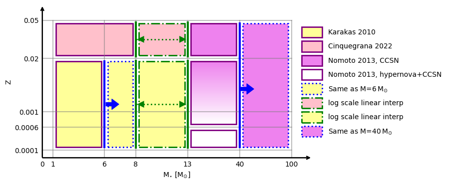
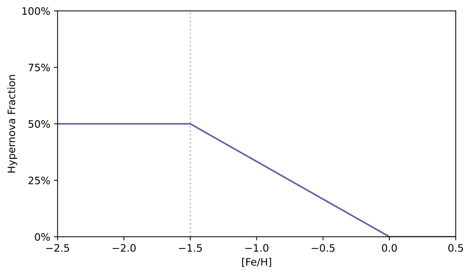
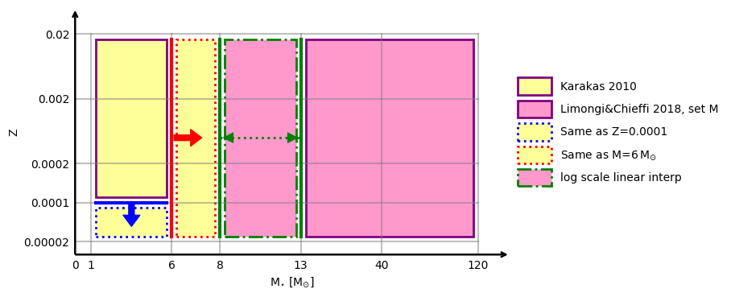

# Stellar Yield Tables for NuPyCEE

### Created by Ziyi Guo

---

## `agb_and_massive_stars_K10_C22_N13.txt`

The combination scheme of this yield table is illustrated in the figure above. The detailed prescription is summarized below:

* For stellar masses of 1–6 Msun and metallicities of Z = 0.0001–0.02, the yields are adopted from [Karakas (2010)](https://ui.adsabs.harvard.edu/abs/2010MNRAS.403.1413K/abstract?utm_source=chatgpt.com) (K10).

* For stellar masses of 1–8 Msun and metallicities of Z = 0.02–0.05, the yields are adopted from [Cinquegrana et al. (2022)](https://ui.adsabs.harvard.edu/abs/2022MNRAS.510.1557C/abstract?utm_source=chatgpt.com) (C22).

* For stellar masses of 13–40 Msun and metallicities of Z = 0.02–0.05, the yields are adopted from [Nomoto et al. (2013)](https://ui.adsabs.harvard.edu/abs/2013ARA%26A..51..457N/abstract?utm_source=chatgpt.com) (N13), assuming all stars explode as core-collapse supernovae (CCSNe).

* For stellar masses of 13–40 Msun and metallicities of Z = 0.0001–0.0006, the yields are also adopted from N13, but with a fixed hypernova fraction of 50%, i.e., half of the stars explode as CCSNe and half as hypernovae.

* For stellar masses of 6–8 Msun and metallicities of Z = 0.0001–0.02, the yields are copied from the corresponding 6 Msun models at the same metallicity.

* For stellar masses of 13–40 Msun and metallicities of Z = 0.006–0.02, the yields are computed from a metallicity-dependent combination of N13 CCSN and hypernova yields. The hypernova fraction decreases linearly from 50% to 0% with increasing metallicity, as illustrated below:

* For stellar masses of 8–13 Msun and metallicities of Z = 0.0001–0.05, the yields are obtained through logarithmic linear interpolation between the 8 Msun and 13 Msun models.

* For stellar masses above 40 Msun, the yields are copied from the 40 Msun models.

---

## `agb_and_massive_stars_K10_lc18_XXX.txt`

The combination scheme of this yield table is illustrated in the figure above. The detailed prescription is summarized below:

* For stellar masses of 1–6 Msun and metallicities of Z = 0.0001–0.02, the yields are adopted from [Karakas (2010)](https://ui.adsabs.harvard.edu/abs/2010MNRAS.403.1413K/abstract?utm_source=chatgpt.com) (K10).

* For stellar masses of 13–120 Msun and metallicities of Z = 0.0002–0.02, the yields are adopted from [Limongi & Chieffi (2018)](https://ui.adsabs.harvard.edu/abs/2018ApJS..237...13L/abstract?utm_source=chatgpt.com) (LC18).

* For stellar masses of 1–6 Msun and metallicities of Z = 0.00002–0.0001, the yields are copied from the Z = 0.0001 models.

* For stellar masses of 6–8 Msun, the yields are copied from the 6 Msun models.

* For stellar masses of 8–13 Msun, the yields are obtained through logarithmic linear interpolation between the 8 Msun and 13 Msun models.
